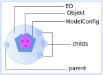
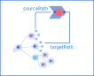

> [elasticobjects.org](https://www.elasticobjects.org/examples/ExamplesStart.html) provide a detailed documentation with interactive examples build by template calls. The sources you find in  [example-springboot](example-springboot).

# (EO) Elastic Objects

Elastic Objects is a tiny layer offering path access methods to any java object tree.

The access
to underlying
java objects is mediated by key and
<strong>strict object configurations</strong> defined by
<nobreak><a href="elastic-objects/src/main/resources/ModelConfig.json"> &nbsp;ModelConfig.json</a></nobreak>
and
<nobreak><a href="elastic-objects/src/main/resources/FieldConfig.json"> &nbsp;FieldConfig.json</a></nobreak>
in the class path. The configurations become first class citizen to determine type in an object tree.

Embedded
 <nobreak><a href="elastic-objects/src/main/java/org/fluentcodes/projects/elasticobjects/calls/Call.java"> &nbsp;Call</a></nobreak>
objects could manipulate the object tree with a generic execute method.
It's a "Remote Object Call" (ROC) architecture instead of RPC concepts.

With the configuration key embedded in json the serialization/deserialization allows
typesafe communication between computers without endpoints or web frameworks.
Embedded in arbitrary text it could initiate complex workflows or compose complex text.

## Core (elastic-objects)
### elastic-objects Module
The [core](elastic-objects) has actually no dependencies beside Log4j and is rather small with a jar size of approximately 90 KB.

    <dependency>
        <groupId>org.fluentcodes.projects.elasticobjects</groupId>
        <artifactId>elastic-objects</artifactId>
        <version>0.9.4</version>
    </dependency>

<a href="https://mvnrepository.com/artifact/org.fluentcodes.projects.elasticobjects/elastic-objects">mvn repository</a>

### elastic-objects Examples

The following examples you find in
<nobreak><a href="elastic-objects-test/src/test/java/org/fluentcodes/projects/elasticobjects/documentation/EOReadmeTest.java"> &nbsp;EOReadmeTest</a></nobreak>
as runnable tests.
The test object is
<nobreak><a href="elastic-objects-test/src/main/java/org/fluentcodes/projects/elasticobjects/domain/test/AnObject.java"> &nbsp;AnObject</a></nobreak>.

#### Get and Set

Some get and set operations.

    EoRoot root = EoRoot.ofValue(CONFIG_MAPS, new AnObject());
    EOInterfaceScalar child = root.set("test", "myAnObject", "myString");
    
    assertEquals("test", root.get("myAnObject", "myString"));
    assertEquals("test", child.get());

#### Underlying Object

The set method changes the value of  
<nobreak><a href="elastic-objects-test/src/main/java/org/fluentcodes/projects/elasticobjects/domain/test/AnObject.java"> &nbsp;AnObject</a></nobreak>
via its
<a href="https://elasticobjects.org/config/ModelConfig/AnObject">≡AnObject</a> configuration :

    EoRoot root = EoRoot.ofValue(CONFIG_MAPS, new AnObject());
    root.set("test", "myAnObject", "myString");
    
    AnObject anObject = (AnObject) root.get();
    assertEquals("test", anObject.getMyAnObject().getMyString());    

#### String Path Representation

For all accessors one can use a path string with a "/" delimiter like in a file system. Again we set
the value *test* in the fields [≡AnObject](https://elasticobjects.org/config/ModelConfig/AnObject) and [≡myString](https://elasticobjects.org/config/FieldConfig/myString).

    EoRoot root = EoRoot.ofValue(CONFIG_MAPS, new AnObject());
    EOInterfaceScalar child = root.set("test", "myAnObject/myString");
    
    assertEquals("test", root.get("myAnObject/myString"));
    assertEquals("test", child.get());

#### Remove child

One can remove a branch from the object tree in a path way.

    EoRoot root = EoRoot.ofValue(CONFIG_MAPS, new AnObject());
    EOInterfaceScalar child = root.set("test", "myAnObject/myString");
    
    EO parent = child.remove();
    assertFalse(parent.hasEo("myString"));
    
    AnObject parentObject = (AnObject) parent.get();
    assertNull(parentObject.getMyString());    

#### Field Length Restrictions

The field configuration [≡myString](https://elasticobjects.org/config/FieldConfig/myString) has a max size of 20. It will be checked when setting a value. In this example the value *test01234567890123456789* has the length 24 and produce an exception.

    EoRoot root = EoRoot.ofClass(CONFIG_MAPS, AnObject.class);
    assertEquals(AnObject.class, root.getModelClass());
    Assertions.assertThatThrownBy(
            ()->{root.set("test01234567890123456789", "myString");})
            .isInstanceOf(EoException.class)
            .hasMessageContaining("Problem creating child at '/' with key 'myString' with value 'test01234567890123456789' with message String value for field 'test01234567890123456789' has size 24 bigger than max length 20.");

Interactive example: https://www.elasticobjects.org/examples/AnObjectTooLong.html.

#### Restrictions to a Map

It's possible to add field configurations with a Map as underlying object. In
<nobreak><a href="elastic-objects-test/src/main/resources/ModelConfig.json"> &nbsp;ModelConfig.json</a></nobreak>
the configuration of
<a href="https://elasticobjects.org/config/ModelConfig/AnObjectMap">≡AnObjectMap</a>
has the field definition
<a href="https://elasticobjects.org/config/FieldConfig/myString">≡myString</a>.
This will be checked within
<nobreak><a href="elastic-objects/src/main/java/org/fluentcodes/projects/elasticobjects/models/ModelConfigMap.java"> &nbsp;ModelConfigMap</a></nobreak>

.

Here the previous example with "AnObjectMap":

    EoRoot root = EoRoot.ofClassName(CONFIG_MAPS, "AnObjectMap");
    assertEquals(LinkedHashMap.class.getSimpleName(), root.get().getClass().getSimpleName());
    Assertions.assertThatThrownBy(
            ()->{root.set("test01234567890123456789", "myString");})
            .isInstanceOf(EoException.class)
                .hasMessageContaining("Problem creating child at '/' with key 'myString' with value 'test01234567890123456789' with message String value for field 'test01234567890123456789' has size 24 bigger than max length 20.");

Interactive example: https://www.elasticobjects.org/examples/AnObjectMapTooLong.html.

##### Field does not exist

When field definition are set, also names will be checked:

    EoRoot root = EoRoot.ofClassName(CONFIG_MAPS, "AnObjectMap");
    Assertions.assertThatThrownBy(
            ()->{root.set("test", "notValid");})
            .isInstanceOf(EoException.class)
            .hasMessageContaining("Problem creating child at '/' with key 'notValid' with value 'test' with message No field defined for 'notValid'.");

Interactive example: https://www.elasticobjects.org/examples/AnObjectMapFieldNotExists.html.

#### Typed JSON

The default json representation contains keys of the model configuration [≡AnObject](https://elasticobjects.org/config/ModelConfig/AnObject):

        EoRoot root = EoRoot.ofValue(CONFIG_MAPS, new AnObject());
        EOInterfaceScalar child = root.set("test", "myAnObject", "myString");
        assertEquals("{\n" +
                "  \"_rootmodel\": \"AnObject\",\n" +
                "  \"(AnObject)myAnObject\": {\n" +
                "    \"myString\": \"test\"\n" +
                "  }\n" +
                "}", root.toJson());

#### From JSON

This typed json will mapped to the appropriate object class when deserialized:

        EoRoot root = EoRoot.ofValue(CONFIG_MAPS, new AnObject());
        root.set("test", "myAnObject", "myString");
        String json = root.toJson();      
         
        EoRoot rootFromJson = EoRoot.ofValue(CONFIG_MAPS, json);       
        assertEquals(AnObject.class, rootFromJson.get().getClass());
        
        AnObject myAnObject = (AnObject)rootFromJson.get();
        assertEquals("test", myAnObject.getMyAnObject().getMyString());

Interactive example: https://www.elasticobjects.org/examples/AnObjectTyped.html.

#### Clone
When a java object is mapped to EO the underlying object is a clone with the same structure and leaf values.

    final AnObject anObject = new AnObject();
    anObject.setMyString("value1");

    final EoRoot rootMap = EoRoot.ofValue(CONFIG_MAPS, anObject);
    final AnObject cloned = (AnObject) rootMap.get();

    assertNotEquals(anObject, cloned);
    assertEquals(anObject.getMyString(), cloned.getMyString());

#### Transform
One can easily transform an object to another type, when the target object has the same fields. The following example  
creates a Map from AnObject:

    final AnObject anObject = new AnObject();
    anObject.setMyString("value2");

    final EoRoot rootMap = EoRoot.ofClass(CONFIG_MAPS, anObject, Map.class);
    final Map transformed = (Map) rootMap.get();

    assertEquals(anObject.getMyString(), transformed.get("myString"));

#### Non Mapped values
Every field key starting with underscore will not be mapped to the parent object.

    final String json = "{\"myString\":\"test\", \"_comment\":\"FieldNames with underscore will not set in parent object.\"}";

    final EoRoot root = EoRoot.ofClass(CONFIG_MAPS, json, AnObject.class);

    assertEquals("FieldNames with underscore will not set in parent object.", root.get("_comment"));
    assertEquals("{\n" +
            "  \"myString\": \"test\"\n" +
            "}", root.toJson(JSONSerializationType.STANDARD));

Interactive example: https://www.elasticobjects.org/examples/Comment.html.

## Calls (eo-calls)
### eo-calls Module
The [calls](eo-calls) module with a jar size of about 150 KB offers some basic calls also using configurations with a role permission concept for
files and directories
simple csv
or templates.

    <dependency>
        <groupId>org.fluentcodes.projects.elasticobjects</groupId>
        <artifactId>eo-calls</artifactId>
        <version>0.9.2</version>
    </dependency>

  

<a href="https://mvnrepository.com/artifact/org.fluentcodes.projects.elasticobjects/eo-calls">mvn repository</a>

### eo-calls Examples

The call classes implementing the
<nobreak><a href="eo-calls/src/test/java/org/fluentcodes/projects/elasticobjects/calls/Call.java"> &nbsp;Call</a></nobreak>
interface offer functionality. A bunch of calls including file access or
templates you find in
<nobreak><a href="eo-calls/src/main/java/org/fluentcodes/projects/elasticobjects/calls"> &nbsp;eo-calls</a></nobreak>.

 The following examples using
 <nobreak><a
 href="eo-calls/src/main/java/org/fluentcodes/projects/elasticobjects/values/SinusValueCall.java"> &nbsp;SinusValueCall</a></nobreak>
are found in
<nobreak><a href="eo-calls/src/test/java/org/fluentcodes/projects/elasticobjects/documentation/EOReadmeTest.java"> &nbsp;EOReadmeTest</a></nobreak>.

#### Java Example

The generic execute method has EO as input.
Here we set the field key "squareDegree" to 2.1 and directly call
 <nobreak><a
 href="eo-calls/src/main/java/org/fluentcodes/projects/elasticobjects/calls/values/SinusValueCall.java"> &nbsp;SinusValueCall</a></nobreak>.

        final Call call = new SinusValueCall();
        EoRoot root = EoRoot.ofValue(CONFIG_MAPS, new HashMap());
        EOInterfaceScalar child = root.set(2.1, "squareDegree");
        assertEquals(2.1, child.get());

        assertEquals(Double.valueOf(0.8632093666488737), call.execute(child));

#### JSON Example

This call could be also embedded in some arbitrary json using the [≡sourcePath](https://www.elasticobjects.org/config/FieldConfig/sourcePath) as input. The result will stored to the [≡targetPath](https://www.elasticobjects.org/config/FieldConfig/targetPath) "sinusValue".

        EoRoot root = EoRoot.ofValue(CONFIG_MAPS, "{\n" +
                "  \"(Double)squareDegree\":1,\n" +
                "  \"(SinusValueCall)sinusValue\": {\n" +
                "    \"sourcePath\": \"/squareDegree\"\n" +
                "  }\n" +
                "}");
        root.execute();
        assertEquals("{\n" +
                "  \"squareDegree\": 1.0,\n" +
                "  \"sinusValue\": 0.8414709848078965\n" +
                "}", root.toJson(JSONSerializationType.STANDARD));

Interactive example: https://www.elasticobjects.org/examples/SinusValueCall.html.

#### Template Example

This json will be interpreted in an arbitrary text file via template call with the "@{...}" pattern. Here the target _asString will return the result to the template instead of setting the target in json.

        EoRoot root = EoRoot.of(CONFIG_MAPS);
        String template = "START - @{\n" +
                "  \"(Double)source\":1,\n" +
                "  \"(SinusValueCall)_asString\": {\n" +
                "    \"sourcePath\": \"/source\"\n" +
                "  }\n" +
                "}. - END";
        Call call = new TemplateCall(template);
        assertEquals("START -0.8414709848078965 - END", call.execute(root));

Interactive example: https://www.elasticobjects.org/examples/SinusValueCallTemplate.html.

##### Other Template forms
Calls could be included in an attribute and command form. This will be demonstrated by the following examples:
* https://www.elasticobjects.org/examples/SinusValueCallCommandTemplate.html
* https://www.elasticobjects.org/examples/SinusValueCallAttributeTemplate.html

#### Files
http://localhost:8080/examples/FileCall.html
http://localhost:8080/examples/JsonCall.html

#### Templates
Interactive Examples: http://localhost:8080/examples/TemplateExamples.html

## Csv (eo-csv)
[eo-csv](eo-csv) offers calls and configurations for reading and writing csv files  using [OpenCsv](https://mvnrepository.com/artifact/com.opencsv/opencsv).

    <dependency>
        <groupId>org.fluentcodes.projects.elasticobjects</groupId>
        <artifactId>eo-csv</artifactId>
        <version>0.9.4</version>
    </dependency>

<a href="https://mvnrepository.com/artifact/org.fluentcodes.projects.elasticobjects/eo-csv">mvn repository</a>

Interactive examples: http://localhost:8080/examples/ListCall.html

## Database (eo-db)
[eo-db](eo-db)
is experimental providing the execution of sql configurations as list or as query.

    <dependency>
        <groupId>org.fluentcodes.projects.elasticobjects</groupId>
        <artifactId>eo-db</artifactId>
        <version>0.9.4</version>
    </dependency>

<a href="https://mvnrepository.com/artifact/org.fluentcodes.projects.elasticobjects/eo-db" style="font-size:9px;">mvn repository</a>

Interactive examples: https://www.elasticobjects.org/examples/DbCall.html.

## Excel (eo-xlsx)
[eo-xlsx](eo-xlsx) offers calls and configurations for reading and writing xlsx files using [Apache POI](https://mvnrepository.com/artifact/org.apache.poi/poi).

    <dependency>
        <groupId>org.fluentcodes.projects.elasticobjects</groupId>
        <artifactId>eo-xlsx</artifactId>
        <version>0.9.4</version>
    </dependency>

Interactive examples: http://localhost:8080/examples/ExcelCall.html

## Other Modules
### elastic-objects-test
[elastic-objects-test](elastic-objects-test) provide tests for the [elastic-objects](elastic-objects) module.  The main package providing test helper and test objects to other modules.

Since it has just test purposes there is actual no package on [mvn central](https://mvnrepository.com/artifact/org.fluentcodes.projects.elasticobjects/).

### examples-springboot
[examples-springboot](example-springboot)
are the sources for the spring boot web example on
[http://www.elasticobjects.org](http://www.elasticobjects.org).

Since it has just demo purposes there is actual no package on [mvn central](https://mvnrepository.com/artifact/org.fluentcodes.projects.elasticobjects/).

## Background

### Elastic Objects

    Elastic Objects is a generic object wrapper skin
    with <strong>typed</strong> path methods to an java object skeleton.
    Typed objects are embedded in an untyped map structure.

Some code examples you will find in <a href="http://elasticobjects.org/eo/EO.html">http://elasticobjects.org/eo/EO.html</a>.

### Model Configurations

For the access to the embedded java objects EO
    is provided by preloaded <a href="http://elasticobjects.org/configs/ModelConfig.html">model configurations</a> in JSON.

### Call Types

A special
<nobreak><a target="github" href="elastic-objects/src/main/java/org/fluentcodes/projects/elasticobjects/calls/Call.java"> Call</a>
 bean with a
    generic execution method offers <strong>functionality</strong>. Its has the following important fields: 

<ul>
    <li>
<a href="http://elasticobjects.org/config/FieldConfig/sourcePath">≡sourcePath</a>
 for the location of the input</li>
    <li>
<a href="http://elasticobjects.org/config/FieldConfig/targetPath">≡targetPath</a>
 for storing the output</li>
    <li>
<a href="http://elasticobjects.org/config/FieldConfig/condition">≡condition</a>
</li>
</ul>

<!--###  A CSV Example

This example is executable on
<a href="https://www.elasticobjects.org/Home.html#templateResourceCallHtml">elasticobjects.org</a>.

    {
    "data": {
        "(CsvSimpleReadCall)csv":{
             "configKey"="AnObject.csv"
        },
        "(TemplateResourceCall)abc":{
            "configKey":"table.tpl",
            "sourcePath":"/data/csv",
            "targetPath":"/_asTemplate"
        }
    },
    "asTemplate":true
    }

### Elements

<ul>
    <li>
<nobreak><a target="github" href="elastic-objects/src/main/java/org/fluentcodes/projects/elasticobjects/calls/lists/CsvSimpleReadCall.java"> CsvSimpleReadCall</a>
 reads
<nobreak><a target="github" href="elastic-objects-test/src/main/resources/input/assets/bt/AnObject.csv"> AnObject.csv</a>
 and store it under the path "/data/csv"</li>
    <li>
<nobreak><a target="github" href="elastic-objects/src/main/java/org/fluentcodes/projects/elasticobjects/calls/templates/TemplateResourceCall.java"> TemplateResourceCall</a>
 use /data/csv as input
<nobreak><a target="github" href="example-springboot/src/main/resources/templates/table.tpl"> table.tpl</a>
 and store it under the path "_asTemplate"</li>
</ul>
<a href="http://elasticobjects.org/config/ModelConfig/TemplateResourceCall">≡TemplateResourceCall</a>
 is part of the core module.
    Templates are just files with certain placeholders .

### Sending Template

    The following example is executable on
    <a href="https://www.elasticobjects.org/Home.html#templateCall">elasticobjects.org</a>

    <h1>An Example Template</h1>
    
    <h2>CSV</h2>
    #{CsvSimpleReadCall->AnObject.csv, data/csv}.
    #{TemplateResourceCall->table.tpl, data/csv}.
    
    <h2>Excel</h2>
    #{XlsxReadCall->AnObject.xlsx:test, data/xlsx}.
    #{TemplateResourceCall->table.tpl, data/xlsx}.
    
    <h2>DB</h2>
    #{DbSqlReadCall->h2:mem:basic, h2:mem:basic:AnObject, data/db}.
    #{TemplateResourceCall->table.tpl, data/db}.

#### Short Form

In the template a short form of one call JSON is used:

     #{CsvSimpleReadCall->AnObject.csv, data/csv}.

is equivalent to

    @{"(CsvSimpleReadCall)":{
         "fileConfigKey":"AnObject.csv",
         "targetPath":"data/csv"     
    }}.

and

    #{TemplateResourceCall->table.tpl, data/csv}.

is equivalent to

    @{"(TemplateResourceCall)":{
         "fileConfigKey"="table.tpl",
         "sourcePath": "data/csv"    
    }}.
 

#### Elements

   On elasticobjects.org a second endpoint is defined for receiving templates via
   <a target="github" href="example-springboot/src/main/java/org/fluentcodes/projects/elasticobjects/web/WebEo.java"> WebEo.java</a>.

<ul>
    <li>
<nobreak><a target="github" href="elastic-objects/src/main/java/org/fluentcodes/projects/elasticobjects/calls/lists/CsvSimpleReadCall.java"> CsvSimpleReadCall</a>
 with
<nobreak><a target="github" href="elastic-objects-test/src/main/resources/input/assets/bt/AnObject.csv"> AnObject.csv</a>
</li>
    <li>
<nobreak><a target="github" href="eo-xlsx/src/main/java/org/fluentcodes/projects/elasticobjects/calls/xlsx/XlsxReadCall.java"> XlsxReadCall</a>
 with
<nobreak><a target="github" href="example-springboot/input/data/lists/AnObject.xlsx"> AnObject.xlsx:test</a>
</li>
    <li>
<nobreak><a target="github" href="eo-db/src/main/java/org/fluentcodes/projects/elasticobjects/calls/db/DbQueryCall.java"> DbQueryCall</a>
 with
<nobreak><a target="github" href="eo-db/src/main/resources//DbSqlConfig.json"> DbSqlConfig.json</a></nobreak></li>
</ul>

    After each read call the
<nobreak><a target="github" href="elastic-objects-test/src/main/java/org/fluentcodes/projects/elasticobjects/domain/test/AnObject.java"> AnObject</a>
 example data a
<nobreak><a target="github" href="elastic-objects/src/main/java/org/fluentcodes/projects/elasticobjects/calls/templates/TemplateResourceCall.java"> TemplateResourceCall</a>
 will render this
    data with
<nobreak><a target="github" href="example-springboot/src/main/resources/templates/table.tpl"> table.tpl</a>
 again.

-->

## Conclusion

The project has now version 0.9.4.

As a tool for creating and manipulating java objects it offers a lot of benefits.

For productive use in a flexible microservice architecture it's good enough for a proof of concept.

## Links
* https://tech.signavio.com/2017/json-type-information
* https://www.json.org/json-en.html
* https://de.wikipedia.org/wiki/JSON-LD
* http://restcookbook.com/Mediatypes/json/
* https://gkulshrestha.wordpress.com/2013/11/16/embedding-type-information-in-json-posted-to-web-api/
* https://www.newtonsoft.com/json/help/html/T_Newtonsoft_Json_TypeNameHandling.htm
* https://de.wikipedia.org/wiki/JavaScript_Object_Notation
* http://jsonp.eu/
* https://github.com/json-path/JsonPath